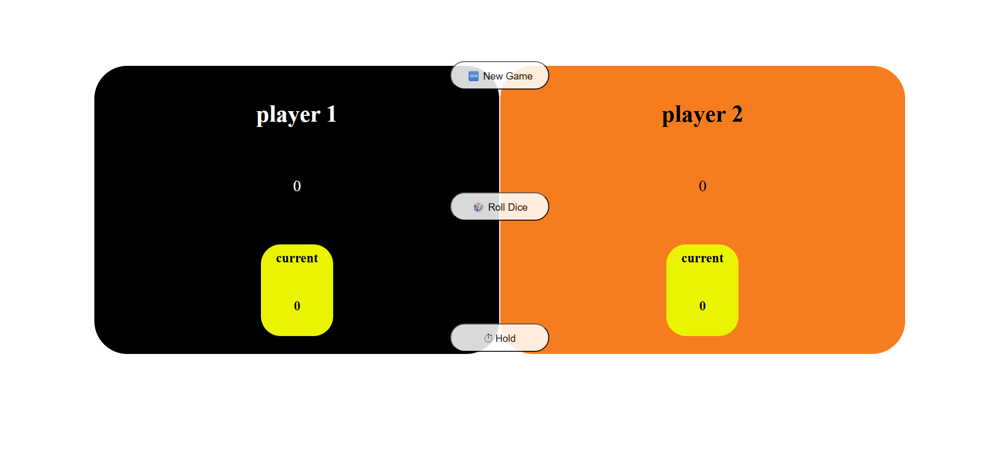

## 🧑‍💻 pig_Game
A very fun game you can play with your friend. The player on the left starts the game. (A black background indicates whose turn it is.)
Each player rolls a dice to accumulate points until they reach 100 to win.
If a player rolls a 1, they lose all the points they've collected in the current turn and the turn switches.
Players can hold their score at any time to secure it before risking a 1

### 🔗[Live Demo](https://pig-game-one-tan.vercel.app/)

> coding to create a game like this actually made me deeply apprehend all necessary functionality and how to think and code
>> this project was one of the best one that I learned javascript fundamentals in practice.
I did it alone while I was practicing and re-learning DOM and basics in javascript

## 🎮 Game_Mechanism
*  🧑‍🤝‍🧑 1-Two-player turn-based game - Players take turns rolling a dice
*  🎲 Roll Dice – Players can roll a dice to accumulate a temporary score
*  💯 Hold Score – Players can hold their temporary score, adding it to their total
*  🥇 Winning Condition – The first player to reach 100 points wins the game
*  🔚 Lose Turn on 1 – Rolling a 1 ends the turn and resets the temporary score.
*  💯 Score Display – Real-time display of both current and total scores

## 🖱️ Interactivity
* Button controls: Roll Dice button / Hold button / New Game button to restart
* Animated Buttons:Buttons animate briefly when clicked using the .animation-btn class
* Dice Image Display : Shows corresponding dice image (dice-1.png to dice-6.png) on each roll

## 🎨 Ui feedback
* Active Player Highlighting – Current player is visually marked using active-player class
* Winner Highlight – Winning player is highlighted using the winner class
* Dice Visibility – Dice is hidden at the start and shown only during gameplay
 
## 🔄 Utility Functions
* init() Function – Resets the game state and UI.
* switchPlayer() Function – Handles switching turns between players
* 
## ⚒️ Built With
* HTML5
* CSS 3
* Vanilla JavaScript
  

## 📸 Image
  

### 🧑‍💻 Author
###### Mohammad Baghban Rezaee
###### GitHub: https://github.com/mohammadr1997

